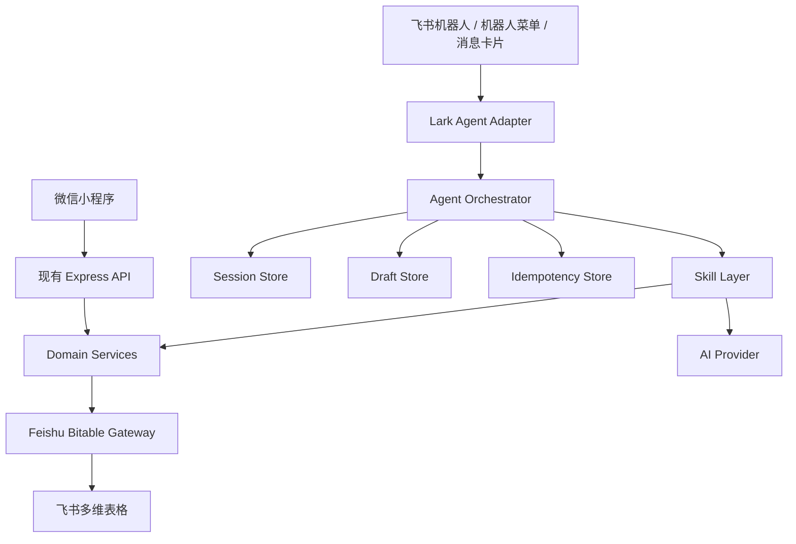
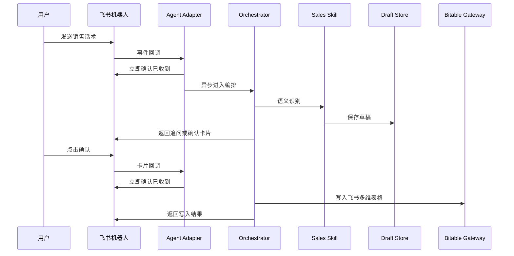
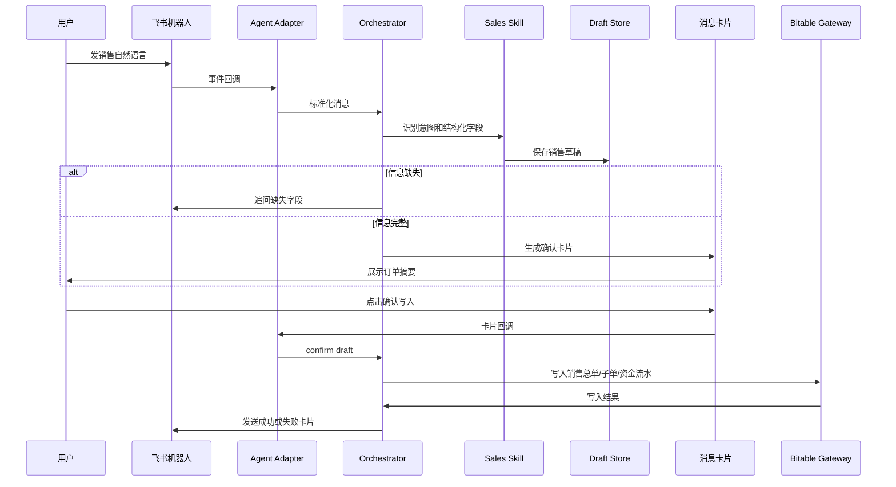
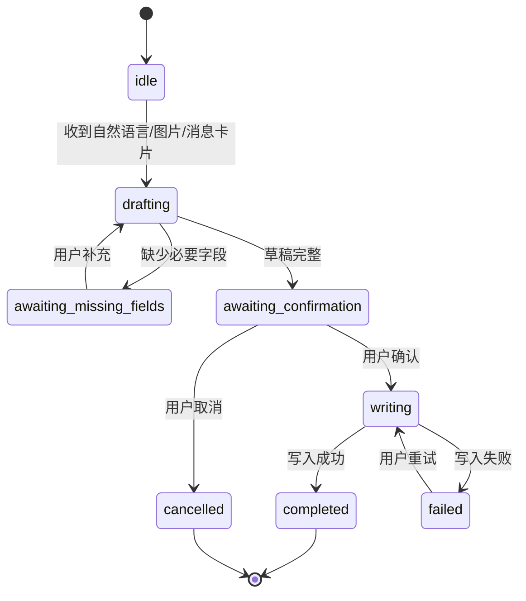

# 鞋仓智能体技术设计（Plan B）

## 1. 背景与定位

项目当前进入飞书 V1 阶段：飞书私聊机器人是唯一继续开发的业务入口，网页工作台后续复用同一套业务服务。微信小程序链路冻结，当前不删除，但不再维护；稳定观察后将整块退役。飞书代码不得依赖微信 controller、route 或旧销售任务存储。

产品名：鞋仓智能体
工作名称：邯美进销存助手（仓库名建议 `hanmei-feishu-ops`）
内部代号：lark-agent

第一阶段只做数据录入。查询和分析暂不重复建设页面，优先复用飞书多维表格已有的视图、筛选、分组、统计和仪表盘能力。数据录入是后续查询和分析的基础，也是业务数字化转型的第一步。

## 2. 设计目标

1. 让销售、采购、库存数据能够更低成本地进入飞书多维表格。
2. 将自然语言、图片、消息卡片三种输入统一转换为结构化业务数据。
3. 写入前必须可复核、可确认，避免 AI 误写业务数据。
4. 后端保持业务规则中心，不让飞书前端交互直接绕过后端写表。
5. 模块边界清楚，后续可以替换模型、缓存、消息卡片、飞书写入实现或某个业务 Skill。

## 3. 非目标

1. 第一阶段不做完整查询和分析智能体。
2. 第一阶段不做开放式通用 AI Agent。
3. 不把飞书 CLI 放进生产业务链路。
4. 不让机器人直接自由修改多维表格，所有写入必须经过后端校验和确认。

## 4. 总体架构



核心原则：

- 飞书智能体只做交互入口。
- 自建后端仍然是唯一业务规则中心。
- 生产链路优先使用飞书 SDK；SDK 不覆盖时直接调用 OpenAPI。
- 飞书 CLI 只用于开发、调试、初始化、查权限、建表和一次性修复。

### 4.1 工作流智能体分层

鞋仓智能体不是开放式通用 Agent，而是工作流智能体。它由两部分组成：

1. 语义识别层：通过角色设定、任务设定、输出格式和示例约束，让大模型理解用户原话。
2. 确定性工作流层：通过代码和状态机规定每一步应该做什么、能不能做、下一步去哪里。

分工原则：

| 层级 | 负责内容 | 不负责内容 |
|---|---|---|
| AI / Skill | 理解用户表达、识别意图、抽取字段、理解补充和修改指令 | 不直接写表，不决定最终合法性 |
| Workflow / State Machine | 决定追问、确认、取消、写入、重试等下一步动作 | 不做自由发挥式推理 |
| Domain Rules | 金额校验、字段必填、支付拆分、写入张数、业务合法性 | 不理解自然语言 |
| User Confirmation | 对关键数据和写入动作做最终确认 | 不承担系统校验职责 |

一句话原则：需要语义理解的交给 AI，需要稳定执行的交给代码，需要关键决策的交给用户确认。

### 4.2 Skill 提示词约束

销售 Skill 的提示词需要明确限定角色、任务、边界和输出格式。

建议包含：

- 角色：你是鞋仓销售录入助手，只处理鞋类销售录入相关内容。
- 任务：从用户原话中提取销售意图、商品明细、金额、支付方式、客户信息和备注。
- 边界：不能编造货号、尺码、金额和支付方式；缺字段必须标记为 missing_fields。
- 输出：只能输出结构化 JSON，不输出解释性自然语言。
- 验证标准：普通销售必须满足商品、金额、支付方式完整；拆分支付金额合计必须等于已收金额。
- 低频场景：退货、换货、预售、补收款优先返回对应 intent，由工作流转消息卡片或强确认。

示例表达应随着真实样本持续补充，例如：

```text
走微信 = 支付方式微信
扫了200 = 微信或支付宝收款 200，若上下文不明确需要追问支付方式
剩下现金 = 剩余金额用现金支付
第二双改39 = 修改草稿中第二条商品尺码为 39
```

### 4.3 飞书应用与环境变量边界

现有 `box2bitable` 后端已经通过飞书应用写入多维表格。当前 `.env` 中的 `FEISHU_APP_ID` 用于后端访问飞书多维表格，不等同于微信小程序前端自己的应用 ID。

后续如果新建「鞋仓智能体」飞书机器人应用，建议将机器人应用配置和现有多维表格写入配置分开：

| 配置 | 用途 |
|---|---|
| `FEISHU_APP_ID` / `FEISHU_APP_SECRET` | 现有后端写入飞书多维表格 |
| `FEISHU_BITABLE_APP_TOKEN` / `FEISHU_BITABLE_TABLE_ID` | 现有采购/库存等表格目标 |
| `LARK_AGENT_APP_ID` / `LARK_AGENT_APP_SECRET` | 新飞书机器人应用 |
| `LARK_AGENT_VERIFICATION_TOKEN` | 飞书事件回调用于校验来源 |
| `LARK_AGENT_ENCRYPT_KEY` | 飞书事件加密时用于解密 |

这样可以避免两个问题：

1. 机器人交互权限和表格写入权限混在一起，后期排查困难。
2. 未来更换机器人应用或更换写表应用时，需要同时改动多处业务代码。

最终是否共用同一个飞书应用，需要结合权限和运维便利性决定；但代码层面应按「机器人入口配置」和「多维表格写入配置」分开设计。

### 4.4 数据存储边界

当前项目没有独立数据库，业务数据全部放在飞书多维表格中。第一版鞋仓智能体也沿用这个原则。

需要沉淀的数据包括：

- 销售总单、销售子单、资金流水。
- 采购记录。
- 库存记录。
- 退货、换货、预售、补收款等低频业务记录。
- `Skill表达样本`。

后端本地缓存只保存短期会话状态、待确认草稿、图片批次和幂等记录，不作为长期业务数据库。后续如果并发、可靠性或查询性能不足，再考虑引入 Redis、SQLite 或数据库，但这不是第一版前提。

## 5. 模块边界

| 模块 | 职责 | 可替换点 |
|---|---|---|
| Lark Agent Adapter | 接收飞书事件、校验回调、解析消息、处理卡片按钮、发送回复 | 后续可替换为其他 IM 平台入口 |
| Agent Orchestrator | 管理会话状态、路由到对应 Skill、决定追问/确认/写入 | 可替换编排策略或状态机实现 |
| Skill Layer | 将输入转换为结构化草稿，包括销售自然语言、采购图片、库存图片、低频消息卡片 | 可单独替换某个 Skill |
| Domain Services | 执行业务校验、金额分摊、订单构建、采购/库存聚合 | 复用现有后端业务逻辑 |
| Draft Store | 保存待确认草稿 | 第一版可文件/内存，后续可 Redis/SQLite |
| Session Store | 保存多轮上下文状态 | 可换 Redis/数据库 |
| Idempotency Store | 防止重复点击确认导致重复写入 | 可换 Redis/数据库唯一约束 |
| Feishu Bitable Gateway | 封装飞书 SDK/OpenAPI 写入和查询字段结构 | 可从 SDK 切到 OpenAPI，或反向替换 |
| AI Provider | 负责模型调用与结构化抽取 | 可从豆包换成其他模型 |
| Card Renderer | 生成消息卡片 JSON | 可替换卡片样式，不影响业务逻辑 |
| Learning Collector | 记录用户原话、AI 识别结果、用户修改和最终确认数据 | 可从飞书表迁移到数据库或标注系统 |

## 6. 销售实时性保障

销售录入发生在真实交易现场，交互必须接近实时。架构上按「快速响应、异步写入、明确反馈、可恢复」设计。

实时链路：



关键保障：

1. 飞书事件入口只做验签、去重、快速应答，不在入口里阻塞等待全部业务完成。
2. 语义识别、草稿生成、写入飞书放到后端编排流程中执行。
3. 每个销售草稿生成 `draft_id`，每次确认生成 `idempotency_key`，避免重复点击造成重复写入。
4. 用户发出消息后必须尽快收到「已收到 / 正在识别 / 需要补充 / 请确认」之一，避免现场不知道系统是否卡住。
5. 写入飞书失败时保留草稿和失败原因，允许重试，不要求用户重新说一遍。
6. 销售自然语言只处理高频低风险路径；退货、换货、预售等高风险路径进入消息卡片或更强确认。

建议响应目标：

| 节点 | 目标 |
|---|---|
| 事件回调应答 | 1 秒内 |
| 普通销售草稿生成 | 3-5 秒内 |
| 确认卡片展示 | 5 秒内 |
| 确认后写入结果反馈 | 3-8 秒内 |
| 失败重试反馈 | 保留草稿并明确失败原因 |

## 7. 三类数据录入交互

### 7.1 销售：自然语言 + Skill + 消息卡片确认

销售是高频、灵活、口语化场景，适合自然语言录入。

销售不必须从菜单开始。用户可以直接在机器人会话里发送文字，或使用飞书会话内的语音转文字能力发送文本；后端通过飞书 IM 消息事件接收文字内容，进入销售 Skill 识别流程。

第一版建议：

- 文字消息作为首要支持路径。
- 语音优先使用飞书端语音转文字后的文本，不在后端单独做音频下载和 ASR。
- 如果后端收到的是纯音频消息而不是转写文本，第一版可以提示用户使用飞书语音转文字后发送。
- 「销售录入」菜单只作为提示入口，用来告诉用户可以直接发销售话术，不强制切页面。

需要识别：

- 普通销售、预售、退货、换货等业务意图。
- 一单一双或一单多双。
- 单一支付或拆分支付。
- 货号、颜色、尺码、数量、单价、总金额。
- 支付方式：现金、微信、支付宝等。
- 客户信息、备注、缺失字段。

流程：



销售 Skill 第一阶段优先支持：

1. 普通销售，一单一双，单一支付。
2. 普通销售，一单多双，单一支付。
3. 普通销售，一单多双，拆分支付。
4. 预售或部分收款先作为明确消息卡片入口，避免第一版自然语言误判。

### 7.1.1 补充与修改流程

销售现场经常不能一次说完全部信息，必须支持多轮补充和修改。

典型补充：

```text
用户：张姐买了两双，A3357 黑色 40，B8805 白色 38，总共358
系统：缺少支付方式，请补充
用户：微信200，现金158
系统：合并到当前草稿，重新校验后发确认卡片
```

典型修改：

```text
用户：第二双尺码改成39，支付改成微信全款
系统：识别为 update_draft，修改当前草稿，重新计算金额和支付流水
```

修改指令不直接写表，先转换为草稿变更：

```json
{
  "operation": "update_draft",
  "changes": [
    { "target": "items[1].size", "value": 39 },
    { "target": "payments", "value": [{ "pay_method": "微信", "amount": 358 }] }
  ]
}
```

代码合并变更后，必须重新执行字段校验、金额校验和确认卡片渲染。用户没有再次确认前，不能写入飞书。

### 7.1.2 消息卡片能力

销售确认卡片至少需要包含：

- 商品明细：货号、颜色、尺码、数量、金额。
- 收款信息：总应收、已收、支付方式、拆分支付明细。
- 业务信息：普通销售/预售/退货/换货、客户、备注。
- 操作按钮：确认写入、修改、取消。

修改入口可以分两种：

1. 卡片内字段修改：适合金额、支付方式、尺码等标准字段。
2. 自然语言修改：适合用户顺手补充，例如「第二双改39」「剩下走现金」。

卡片每次更新都应携带 `draft_id` 和 `idempotency_key`，后端只接受当前最新草稿版本的确认动作。

### 7.2 采购：图片上传 + 识别 + 复核

采购是低频、批量、相对规范的场景，适合上传供应商采购单。

流程：

1. 用户通过机器人菜单选择「采购录入」。
2. 后端收到菜单事件，将当前会话状态切到 `awaiting_purchase_image`。
3. 机器人推送一张上传引导消息卡片，提示用户在当前会话上传采购单图片或附件。
4. 用户使用飞书原生消息能力发送一张或多张图片/附件。
5. 后端通过飞书 IM 消息事件接收图片/附件消息，按当前会话状态归入同一个采购草稿批次。
6. 用户点击卡片上的「开始识别」或「完成上传」按钮。
7. 后端下载资源并识别，生成采购草稿和复核卡片。
8. 用户确认后写入采购表。

第一版不建议在消息卡片内实现附件提交框。卡片只负责引导、显示已收到的图片数量、触发开始识别和取消；图片上传使用飞书会话原生能力完成。

### 7.3 库存：图片上传 + 识别 + 复核

库存盘点适合拍摄带规格的鞋盒标签。

流程：

1. 用户通过机器人菜单选择「库存录入」。
2. 后端收到菜单事件，将当前会话状态切到 `awaiting_inventory_image`。
3. 机器人推送一张上传引导消息卡片，提示用户在当前会话上传鞋盒或标签图片。
4. 用户使用飞书原生消息能力发送一张或多张图片/附件。
5. 后端通过飞书 IM 消息事件接收图片/附件消息，按当前会话状态归入同一个库存草稿批次。
6. 用户点击卡片上的「开始识别」或「完成上传」按钮。
7. 后端下载资源并识别，生成库存草稿和复核卡片。
8. 用户确认后写入库存表。

第一版不建议在消息卡片内实现附件提交框。原因同采购：飞书会话原生发图能力更自然，代码上只需要处理消息事件、资源下载和批次归集，复杂度低于维护卡片内上传组件。

### 7.4 低频高风险场景：消息卡片

退货、换货、预定/预售、补收款、撤销等场景频率低，但业务影响大。第一版不建议完全依赖自然语言自动执行，优先使用消息卡片在当前会话内完成，不跳转到外部表单或新页面。

流程：

1. 用户点击机器人菜单，例如「退货/换货」。
2. 后端收到菜单事件，将当前会话状态切到对应低频业务流程。
3. 机器人推送消息卡片，展示需要填写或选择的字段。
4. 用户先提供或选择原订单信息，系统查找并展示候选订单。
5. 用户选择原订单后，在消息卡片内补充退货/换货字段、选择原因、确认或取消。
6. 后端基于卡片回调更新草稿、校验规则，并再次发送确认卡片。
7. 用户确认后，后端写入飞书多维表格并反馈结果。

建议卡片字段：

| 场景 | 消息卡片字段 |
|---|---|
| 退货 | 原订单信息、退货商品、退款金额、退款方式、退货原因、备注 |
| 换货 | 原订单信息、原商品、新商品、差价、补收/退款方式、换货原因、备注 |
| 预售 | 商品明细、客户信息、应收金额、已收定金、预计交付日期、备注 |
| 补收款 | 关联订单、补收金额、支付方式、备注 |

退货和换货必须关联原有订单。第一版可以通过订单号、客户、日期、货号、尺码、金额等信息检索候选订单，再让用户在消息卡片中选择。如果找不到原订单，进入人工补录或异常处理，不直接自动写入。

预售属于销售领域，但频次较低、字段更多、风险更高。第一版建议作为低频业务消息卡片处理，复用销售领域的订单构建和资金流水能力；后续如果真实样本足够多，再让销售 Skill 支持自然语言预售。

## 8. 销售草稿数据结构

销售自然语言不直接写表，先生成草稿。

```json
{
  "draft_id": "draft_xxx",
  "source": "lark_agent",
  "chat_id": "oc_xxx",
  "operator_id": "ou_xxx",
  "intent": "normal_sale",
  "status": "awaiting_confirmation",
  "items": [
    {
      "item_no": "A3357",
      "color": "黑色",
      "size": 40,
      "quantity": 1,
      "unit_price": 199,
      "receivable_amount": 199
    }
  ],
  "payments": [
    {
      "pay_method": "微信",
      "amount": 199
    }
  ],
  "customer": {
    "name": "",
    "phone": ""
  },
  "amounts": {
    "list_amount": 199,
    "discount_amount": 0,
    "receivable_amount": 199,
    "paid_amount": 199
  },
  "missing_fields": [],
  "validation_errors": [],
  "confidence": 0.92,
  "created_at": "2026-08-22T00:00:00.000Z",
  "expires_at": "2026-08-22T01:00:00.000Z"
}
```

金额校验规则：

- `items[].receivable_amount` 合计应等于订单应收金额。
- `payments[].amount` 合计应等于已收金额。
- 普通销售默认应收等于已收。
- 拆分支付必须生成多条资金流水。
- 价格、货号、尺码、支付方式缺失时不能直接写入。

支付方式第一版使用固定枚举：

```text
支付宝 / 微信 / 现金 / 银行卡
```

如果用户说「扫码」「扫了」「转了」但没有明确渠道，系统需要追问是支付宝、微信还是银行卡。

## 9. 状态机

状态机就是业务流程地图。它规定当前这笔录入处在哪个状态、下一步允许去哪里，防止流程乱跳。

例如用户第二次点击「确认写入」时，状态机可以判断草稿已经完成，不能再次写入。用户在 `awaiting_payment` 状态下发「微信200，现金158」时，系统知道这是在补充支付方式，而不是新建一笔没有商品的订单。



建议状态说明：

| 状态 | 含义 | 允许动作 |
|---|---|---|
| idle | 当前会话没有进行中的录入 | 新建销售/采购/库存 |
| drafting | 正在生成或更新草稿 | 保存草稿、校验字段 |
| awaiting_missing_fields | 缺少必要字段，等待用户补充 | 补充、取消 |
| awaiting_confirmation | 草稿完整，等待用户确认 | 确认、修改、取消 |
| writing | 正在写入飞书 | 等待结果，禁止重复写 |
| completed | 写入成功 | 结束，或开始下一笔 |
| failed | 写入失败但草稿保留 | 重试、修改、取消 |
| cancelled | 用户取消 | 结束 |

状态机应由代码实现，不依赖大模型自行判断流程跳转。AI 只给出意图和字段，最终状态迁移由 Orchestrator 决定。

## 10. 后端 API 边界建议

飞书回调使用独立路由；微信遗留接口统一收进可关闭的 legacy router，不与飞书业务服务互相引用。

```text
POST /api/lark/events
POST /api/lark/card-actions

POST /api/agent/sales/draft
POST /api/agent/sales/confirm
POST /api/agent/sales/cancel

POST /api/agent/purchase/recognize
POST /api/agent/purchase/confirm

POST /api/agent/inventory/recognize
POST /api/agent/inventory/confirm

POST /api/agent/operations/return/draft
POST /api/agent/operations/return/confirm
POST /api/agent/operations/exchange/draft
POST /api/agent/operations/exchange/confirm
POST /api/agent/operations/presale/draft
POST /api/agent/operations/presale/confirm
```

其中 `/api/lark/*` 面向飞书回调，负责验签、事件解析和回复。`/api/agent/*` 面向内部编排和业务执行，可以被飞书入口、未来网页入口或其他工具复用。

## 11. 推荐目录结构

第一阶段保留在现有 `server/src`，但按入口、业务、数据访问和基础设施分层。是否拆仓库不作为 V1 上线前置条件。

```text
server/src/
  agent/
    orchestrator/
      agentOrchestrator.js
      stateMachine.js
    skills/
      salesSkill.js
      purchaseSkill.js
      inventorySkill.js
    stores/
      draftStore.js
      sessionStore.js
      idempotencyStore.js
    cards/
      salesConfirmCard.js
      missingFieldsCard.js
      resultCard.js
    learning/
      learningCollector.js
      learningSampleService.js
    adapters/
      larkEventAdapter.js
      larkMessageAdapter.js
  domains/
    sales/
      salesOrderService.js
      salesDraftValidator.js
      salesPaymentAllocator.js
    purchase/
      purchaseIngestService.js
    inventory/
      inventoryIngestService.js
  integrations/
    lark/
      larkClient.js
      bitableGateway.js
      messageGateway.js
```

以下旧模块仅作为历史参考，不作为飞书 V1 的运行依赖：

- `server/src/services/salesTaskService.js` 可作为图片销售任务的参考。
- `server/src/utils/salesOrderBuilder.js` 可继续作为销售订单构建核心。
- `server/src/services/salesOrderFeishuWriter.js` 可抽象成 `BitableGateway` 的销售写入实现。
- `server/src/services/feishuService.js` 后续可拆分采购、库存、附件、字段映射等职责。

### 11.1 现有后端复用与改造点

现有后端曾支撑微信小程序 MVP。现在目标是飞书机器人与未来网页工作台共用业务层；微信仅通过 legacy router 临时兼容。

可复用能力：

- Express 服务入口、`/health` 健康检查和 API Key 鉴权。
- 上传图片限制、临时文件清理和基础日志。
- 豆包识别服务。
- 采购/库存聚合写入逻辑。
- 销售订单构建逻辑：总单、子单、资金流水的基础拆分。
- 飞书 SDK 依赖和现有多维表格写入经验。
- 已有测试体系。

需要改造能力：

- 新增飞书机器人事件入口和卡片回调入口。
- 飞书交互逻辑不得进入原有小程序 controller，也不得反向引用旧 controller。
- 销售模型需要支持拆分支付、多商品自然语言录入和草稿修改。
- 销售写入需要增加幂等，避免重复确认写入多次。
- 采购/库存图片识别需要从「小程序页面复核」扩展到「飞书卡片复核」。
- 长期任务和草稿存储不应只依赖本地 JSON，后续可迁移到 Redis、SQLite 或数据库。
- `FeishuService` 后续应拆成附件、字段映射、采购写入、库存写入、销售写入等更小模块。

## 12. SDK、OpenAPI、CLI 的使用边界

| 工具 | 使用位置 | 说明 |
|---|---|---|
| 飞书 SDK | 生产链路优先使用 | 用于事件回复、消息发送、多维表格写入等稳定能力 |
| OpenAPI | SDK 不覆盖或需要细粒度控制时使用 | 直接控制请求体、卡片能力、新接口 |
| 飞书 CLI | 开发和运维辅助 | 查权限、建表、查字段、初始化、临时修复、一次性迁移 |

不建议在生产机器人消息回调中调用 CLI。原因是 CLI 依赖本机配置、命令输出解析、进程启动、登录态和超时控制，不适合作为高频业务链路。

### 12.1 飞书后台配置与后端实现分工

飞书开发者后台负责配置入口，后端负责真正执行业务。

| 飞书后台 | 我们的后端 |
|---|---|
| 创建应用 | 保存应用配置并区分环境变量 |
| 开启机器人能力 | 接收机器人消息事件 |
| 配置机器人菜单 | 根据菜单 action 进入销售/采购/库存/低频卡片流程 |
| 配置事件订阅 | 校验事件、解析消息、进入编排器 |
| 配置消息卡片回调 | 处理确认、修改、取消、重试 |
| 开通权限范围 | 使用 SDK/OpenAPI 调用对应能力 |

也就是说，飞书后台提供「按钮、入口、回调地址和权限」，业务逻辑仍然在自建后端中。

### 12.2 机器人菜单配置建议

飞书机器人菜单支持多种响应动作，第一阶段已经能满足鞋仓智能体的数据录入入口需求。

| 菜单响应动作 | 适合场景 | 在鞋仓智能体中的用法 |
|---|---|---|
| 事件订阅 / 推送事件 | 用户点击菜单后由后端接管流程 | 进入采购录入、库存录入、退货/换货卡片流程 |
| 跳转至指定链接 | 打开一个明确页面 | 第一版暂不作为核心入口，后续可用于管理页或帮助页 |
| 发送文字消息 | 给用户提示或触发固定话术 | 提示销售自然语言示例、说明当前入口怎么用 |

第一版建议菜单：

| 菜单 | 动作 | 后端处理 |
|---|---|---|
| 销售录入 | 发送文字消息 | 提示用户直接发送销售话术，例如「A3357 黑色40 一双 199，走微信」 |
| 采购录入 | 事件订阅 / 推送事件 | 后端将当前会话状态切到 `awaiting_purchase_image`，推送上传引导卡片 |
| 库存录入 | 事件订阅 / 推送事件 | 后端将当前会话状态切到 `awaiting_inventory_image`，推送上传引导卡片 |
| 退货/换货 | 事件订阅 / 推送事件 | 后端推送退货/换货消息卡片，在会话内完成填写和确认 |
| 使用说明 | 发送文字消息 | 返回简短示例和当前支持范围 |

菜单只负责让用户更容易进入正确流程，不承载业务规则。点击菜单后仍然需要进入 Orchestrator，由状态机、缓存、Skill 和后端校验继续处理。

### 12.3 全程会话内交互方案

第一版目标是在同一个飞书机器人会话内完成全部录入，不跳转页面。

| 业务 | 用户动作 | 飞书入口 | 后端动作 |
|---|---|---|---|
| 销售录入 | 直接发文字 | IM 消息接收事件 | 进入销售 Skill，生成草稿和确认卡片 |
| 销售录入 | 使用飞书语音转文字后发送 | IM 消息接收事件 | 按文字消息进入销售 Skill |
| 采购录入 | 点击菜单后上传一张或多张图片/附件 | 菜单事件 + IM 图片/文件消息事件 + 卡片回调 | 切到 `awaiting_purchase_image`，归集图片，点击开始识别后下载并识别 |
| 库存录入 | 点击菜单后上传一张或多张图片/附件 | 菜单事件 + IM 图片/文件消息事件 + 卡片回调 | 切到 `awaiting_inventory_image`，归集图片，点击开始识别后下载并识别 |
| 退货/换货 | 点击菜单并填写卡片 | 菜单事件 + 卡片回调 | 查找原订单，推送候选订单和业务卡片，接收卡片字段并生成草稿 |
| 修改草稿 | 点卡片修改或继续发自然语言 | 卡片回调或 IM 消息接收事件 | 合并草稿变更，重新校验并刷新卡片 |
| 确认写入 | 点击确认按钮 | 卡片回调 | 幂等校验后写入飞书多维表格 |

销售录入不依赖菜单。菜单可以提供示例和引导，但用户直接发消息给机器人时，机器人也应通过 IM 消息接收事件处理。

语音能力建议：

1. MVP 先稳定支持文字自然语言。
2. 飞书端已经转成文字的语音消息，按文字消息处理。
3. 如果后端收到的是纯音频消息，第一版提示用户使用飞书语音转文字后发送。
4. 不单独维护一套语音业务逻辑。

采购和库存多图批次建议：

1. 点击菜单后创建 `draft_id` 和图片批次。
2. 用户在当前会话发送一张或多张图片/附件。
3. 后端按 `chat_id + operator_id + draft_id + state` 归集图片。
4. 引导卡片展示已收到图片数量，并提供「开始识别」「取消」按钮。
5. 用户点击「开始识别」后，后端下载本批次资源并识别。
6. 如果用户长时间没有点击开始识别，草稿按 TTL 过期清理。

### 12.4 采购/库存「上传完成」语义

「上传完成」不是整个会话结束，也不是机器人任务结束。它只表示当前采购/库存图片批次已经收集完毕，可以进入识别阶段。

建议状态流：

```text
awaiting_purchase_image / awaiting_inventory_image
  ↓ 用户陆续发送图片
collecting_images
  ↓ 卡片显示：已收到 N 张
ready_to_recognize
  ↓ 用户点击「上传完成 / 开始识别」
recognizing
  ↓ 识别完成
awaiting_confirmation
  ↓ 用户确认
writing
  ↓ 写入成功
completed
```

其中：

- `collecting_images`：用户还能继续发图。
- `ready_to_recognize`：已经收到至少一张图，卡片可以显示「上传完成」或「开始识别」按钮。
- `recognizing`：本批次锁定，不再把新图片归入这个批次。
- `completed`：写入完成后，本次草稿结束；但飞书会话仍然存在，用户可以开始下一笔。

如果用户在 `recognizing` 后又发新图片，后端不应混入旧批次。可以提示用户「当前批次正在识别，如需新增请重新点击采购/库存菜单开始下一批」。

SDK 实现映射：

| 能力 | SDK / OpenAPI 方向 | 用途 |
|---|---|---|
| 接收用户图片消息 | 事件订阅 `im.message.receive_v1`，SDK `EventDispatcher` | 收到图片/附件消息后归集到当前批次 |
| 发送上传引导卡片 | SDK `client.im.message.create`，`msg_type=interactive` | 推送「请上传图片」卡片 |
| 更新上传进度卡片 | SDK `client.im.message.patch` 或等价 OpenAPI | 把卡片从「已收到 1 张」更新为「已收到 N 张」 |
| 处理「开始识别」按钮 | SDK `CardActionHandler` / 卡片回调 | 用户点击后锁定批次并进入识别 |
| 下载图片/附件资源 | IM 消息资源下载相关 API | 下载本批次图片交给识别服务 |

实现上不通过飞书 CLI。CLI 只用于开发调试、查权限、查事件结构；生产代码使用飞书 Node SDK，必要时用 SDK 的 `client.request` 调 OpenAPI。

## 13. 上下文与缓存策略

为了减少 token 消耗，不把完整聊天历史交给模型。每轮只传：

- 当前用户消息。
- 当前会话状态。
- 当前草稿摘要。
- 必要字段 schema。
- 可选枚举值，例如支付方式、常用供应商、常用尺码。

建议缓存：

| 缓存 | 内容 | TTL |
|---|---|---|
| Session Store | chat_id、operator_id、当前状态、当前 draft_id | 30-60 分钟 |
| Draft Store | 销售/采购/库存待确认草稿 | 30-60 分钟 |
| Option Cache | 支付方式、供应商、字段枚举、常用货号 | 10-60 分钟 |
| Idempotency Store | 卡片确认按钮的防重复 key | 24 小时 |

第一版可用文件或内存实现，但接口要提前抽象，后续可替换 Redis、SQLite 或云数据库。

### 13.1 缓存实现边界

上下文缓存实现放在我们的后端代码中，不依赖大模型自身记忆。模型每次只处理「当前输入 + 当前草稿摘要 + 当前状态 + 字段约束」。

缓存对象示例：

```json
{
  "chat_id": "oc_xxx",
  "operator_id": "ou_xxx",
  "state": "awaiting_payment",
  "draft_id": "draft_123",
  "intent": "normal_sale",
  "updated_at": "2026-08-22T00:00:00.000Z",
  "expires_at": "2026-08-22T01:00:00.000Z"
}
```

与微信小程序表单相比，飞书智能体不要求用户一次性填写完所有信息。它允许用户分几句话表达、补充和修改；后端用缓存保存草稿，模型只需要理解当前这句话如何作用到当前草稿上。

### 13.2 Token 控制

每次调用 AI 时禁止传入完整聊天记录。推荐输入结构：

```json
{
  "current_message": "微信200，现金158",
  "state": "awaiting_payment",
  "draft_summary": {
    "intent": "normal_sale",
    "items": [
      { "item_no": "A3357", "color": "黑色", "size": 40, "receivable_amount": 199 },
      { "item_no": "B8805", "color": "白色", "size": 38, "receivable_amount": 159 }
    ],
    "receivable_amount": 358,
    "payments": []
  },
  "required_output_schema": "sales_draft_patch"
}
```

这样既能理解「微信200，现金158」是在补充上一笔订单，也能避免把整段聊天历史都交给模型。

## 14. 用户表达样本表

用户的高频表达需要沉淀到一张独立数据表，用于持续优化销售 Skill、提示词和测试用例。该表不参与业务结算，属于 Skill 优化样本库。

建议表名：`Skill表达样本`

存储位置：飞书多维表格。当前项目没有独立数据库，第一版所有长期数据仍然放在多维表格中。

字段建议：

| 字段 | 说明 |
|---|---|
| 样本ID | 唯一 ID |
| 创建时间 | 样本生成时间 |
| 模块 | sales / purchase / inventory |
| 场景 | 新建销售 / 补充信息 / 修改草稿 / 取消 / 确认 |
| 用户原话 | 用户实际发送内容 |
| 当前状态 | 例如 `awaiting_payment`、`awaiting_confirmation` |
| AI识别意图 | normal_sale / split_payment_sale / update_draft 等 |
| AI识别结果 | 结构化 JSON，可脱敏 |
| 缺失字段 | 系统判断缺少哪些字段 |
| 用户修改内容 | 用户后续修改了什么 |
| 最终确认结果 | 最终写入前的结构化摘要 |
| 结果状态 | accepted / modified / rejected / failed |
| 表达标签 | 例如 `走微信`、`扫了`、`剩下现金`、`多双` |
| Skill版本 | 当前提示词/Skill 版本 |
| 模型版本 | 当前 AI 模型版本 |
| 是否已复盘 | 是否已经纳入提示词或测试用例 |
| 备注 | 人工复盘备注 |

采集原则：

1. 记录「原话 -> AI 识别 -> 用户修改 -> 最终确认」完整链路。
2. 不让线上模型自动学习，先沉淀样本，再人工复盘后更新 Skill 示例和测试用例。
3. 手机号、客户姓名等敏感信息应脱敏或只存摘要。
4. 被用户取消或识别失败的样本也要保留，因为这些更能暴露 Skill 的边界。
5. 每次更新 Skill 后，用样本表中的高频表达回归测试，避免新提示词破坏旧表达。

### 14.1 Skill 优化闭环

Skill 表达样本表的价值不只是留日志，而是形成持续优化闭环：

```text
真实用户表达
  ↓
AI 识别结果
  ↓
用户补充/修改/取消/确认
  ↓
沉淀为样本
  ↓
人工复盘高频表达和失败样本
  ↓
更新 Skill 提示词示例
  ↓
加入自动化测试用例
  ↓
回归测试通过后发布新 Skill 版本
```

样本进入 Skill 前需要人工复盘。不要让线上模型根据单条样本自动改提示词，避免把偶发错误、用户口误或异常表达固化进系统。

### 14.2 样本采集触发点

建议在以下节点采集样本：

| 节点 | 采集内容 |
|---|---|
| 新建草稿 | 用户原话、AI 识别结果、缺失字段 |
| 用户补充 | 补充原话、当前状态、草稿变化 |
| 用户修改 | 修改原话、修改前草稿、修改后草稿 |
| 用户确认 | 最终确认结果、写入结果 |
| 用户取消 | 取消时的草稿和原因 |
| 识别失败 | 失败原话、错误类型、模型返回 |

## 15. 可观测性与排查

所有关键节点都要有结构化日志：

- 收到飞书事件：`lark.event.received`
- 事件验签失败：`lark.event.verify_failed`
- Skill 开始和结束：`agent.skill.started` / `agent.skill.completed`
- 草稿创建：`agent.draft.created`
- 缺字段追问：`agent.draft.missing_fields`
- 用户确认：`agent.draft.confirmed`
- 写入开始和结束：`agent.write.started` / `agent.write.completed`
- 写入失败：`agent.write.failed`
- 重复确认拦截：`agent.idempotency.duplicate`
- 用户表达样本采集：`agent.learning.sample_collected`

日志中应包含：

- `request_id`
- `event_id`
- `chat_id`
- `operator_id`
- `draft_id`
- `intent`
- `duration_ms`

不能记录：

- app secret
- access token
- 用户敏感联系方式明文
- 未脱敏的飞书 file token

## 16. 测试策略

第一阶段至少覆盖：

1. 销售自然语言解析：一双、多双、拆分支付、缺字段。
2. 销售金额校验：商品合计、应收、已收、拆分支付合计。
3. 草稿状态机：追问、补充、确认、取消、过期。
4. 幂等确认：重复点击只写入一次。
5. 卡片 action 解析：确认、修改、取消、重试。
6. 飞书写入 gateway：mock SDK 返回成功/失败/部分失败。
7. 采购/库存图片识别结果转草稿。
8. 高频表达样本回归：例如「走微信」「扫了200」「剩下现金」「第二双改39」。

## 17. 分阶段落地

### Phase 1：销售自然语言 MVP

- 新增飞书机器人事件入口。
- 支持销售自然语言解析。
- 生成销售草稿。
- 通过消息卡片确认。
- 确认后复用现有销售订单构建与写入能力。
- 支持幂等和失败重试。
- 建立 `Skill表达样本` 表，记录用户原话、AI 识别、用户修改和最终确认结果。

### Phase 2：采购和库存图片录入

- 机器人菜单接入采购/库存入口。
- 上传图片识别。
- 生成复核卡片。
- 确认后复用现有采购/库存写入逻辑。

### Phase 3：低频业务消息卡片

- 退货、换货、预售、补收款等通过消息卡片完成。
- 卡片提交后进入统一草稿确认和写入流程。

### Phase 4：查询和分析增强

- 如果飞书多维表格能力不足，再补充机器人查询能力。
- 优先做固定问题和经营看板，不做开放式自由分析。

## 18. 待确认问题

1. 新飞书应用是否与现有写多维表格应用分开。
2. 销售总单、销售子单、资金流水三张表是否需要增加幂等字段。
3. 退货、换货、预售是否独立表，还是写入同一套销售总单/子单/资金流水。
4. 第一版上下文缓存采用内存、文件还是 Redis/SQLite。
5. 消息卡片是否只做确认摘要，还是允许直接在卡片内编辑字段。
6. 采购/库存多图批次是必须手动点击「开始识别」，还是允许超时自动识别。
